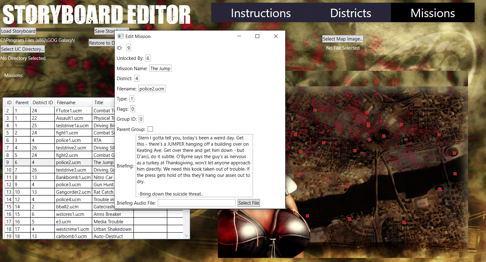
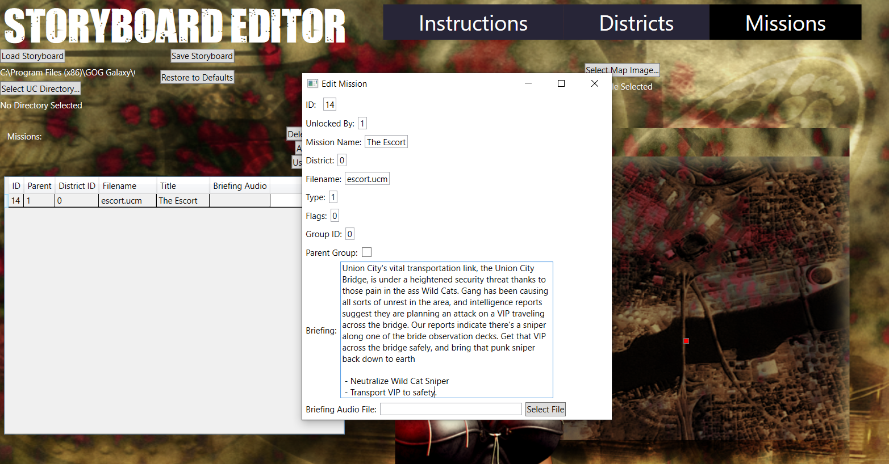
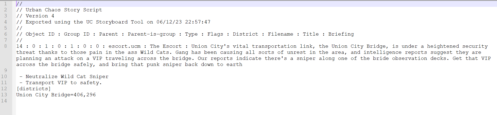

# Urban Chaos Storyboard Editor

## Overview

UC Storyboard Editor is a WPF application designed for creating and editing story scripts (.sty files) for the game "Urban Chaos." This tool simplifies the management of districts, missions, and custom map configurations.

## Features

- Load and edit existing story scripts.
- Manage districts with customizable names and positions on the map.
- Create, modify, and organize missions within the script.
- Import and customize map images for a personalized gaming experience.

## Getting Started

1. **Clone the Repository**

2. **Install Packages:**
You may need to install the System.Drawing.Common NuGet package within Visual Studio   

3. **Build and Run:**
Open the solution in Visual Studio and build the project. Run the application to start editing story scripts.

## Usage

- **Load Script:**
Use the "Load Storyboard" button to load an existing .sty file and start editing.

- **Manage Districts:**
- Add new districts by clicking the "Add District" button.
- Edit district names, X/Y positions, and other properties by double-clicking the item in the grid.

- **Manage Missions:**
- Add, remove, and edit missions within the script.
- Customize mission details and briefing audio.

- **Customize Map:**
- Load custom map images for a personalized gaming environment.
- Export script and custom files for use in the game.

- **Restore:**
- Restore any modified files back to default Urban Chaos files using the "Restore" button.

## Screenshots

## Acknowledgments

- **TGASharpLib:** Special thanks to the creators of [TGASharpLib](https://github.com/ALEXGREENALEX/TGASharpLib), which is used for image conversion in this application.

## Contributing

Contributions are welcome! Feel free to open issues or submit pull requests.

## License

This project is licensed under the [MIT License](LICENSE).
